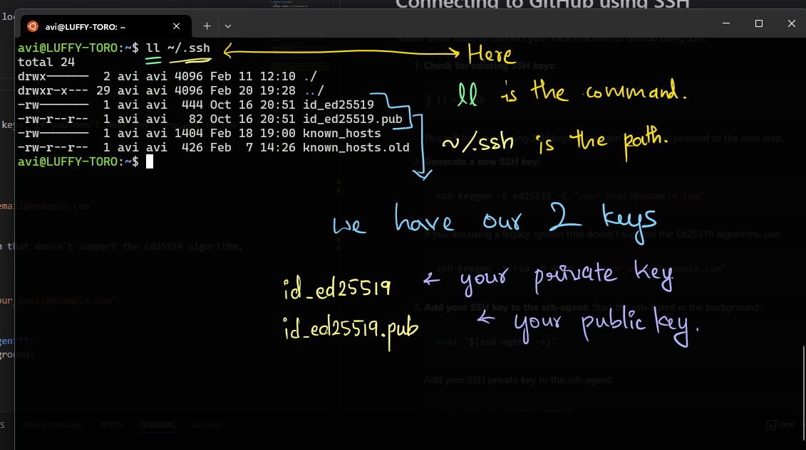

# Connecting to GitHub using SSH

Follow these steps to connect your local machine to GitHub using SSH:

1. 🏷️ **Check for existing SSH keys**:

   ```sh
   ll ~/.ssh
   ```



This will list any existing SSH keys. If you don't have any, proceed to the next step.

1. 🏷️ **Generate a new SSH key**:

   ```sh
   ssh-keygen -t ed25519 -C "your_email@example.com"
   ```

   - After typing and ENTER above command, Just give enter.
   - If you want to set password set it. Or leave it.
   - If you are using a legacy system that doesn't support the Ed25519 algorithm, use: But now a days not using below method.

   ```sh
   ssh-keygen -t rsa -b 4096 -C "your_email@example.com"
   ```

1. 🏷️ **Add your SSH key to the ssh-agent**:
   Start the ssh-agent in the background:

   ```sh
   eval "$(ssh-agent -s)"
   ```

   Add your SSH private key to the ssh-agent:

   ```sh
   ssh-add ~/.ssh/id_ed25519
   ```

   If you used a different name for your key, replace `id_ed25519` with your key's name.

1. **Add the SSH key to your GitHub account**:

   - Copy the SSH key to your clipboard:

   ```sh
   cat ~/.ssh/id_ed25519.pub
   ```

   If you used a different name for your key, replace `id_ed25519.pub` with your key's name.

   - Go to GitHub and navigate to **Settings** > **SSH and GPG keys** > **New SSH key**.
   - Paste your key into the "Key" field and give it a descriptive title.
   - Click **Add SSH key**.

1. **Test the SSH connection**:

   ```sh
   ssh -T git@github.com
   ```

   - You should see a message like:

   ```sh
   Hi username! You've successfully authenticated, but GitHub does not provide shell access.
   ```

You are now connected to GitHub using SSH!
