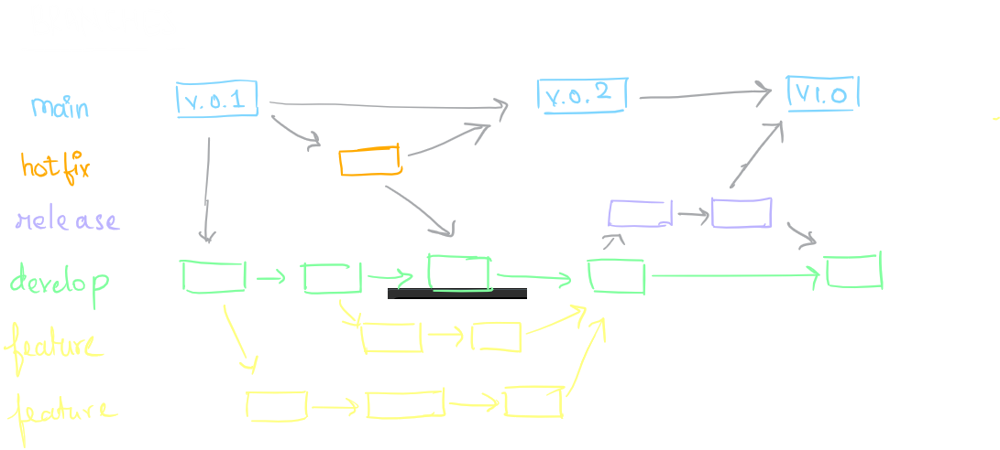

# Notes on Branching Strategies in DevOps

## Why Use Different Branches for Repositories

In a DevOps environment, different branches are used to manage the development workflow and ensure code quality. Here are the common branches and their purposes:

- **Development (dev) Branch**: This is where developers commit their code. It is the main branch for integrating new features and bug fixes. The code here is not yet fully tested.

- **User Acceptance Testing (uat) Branch**: This branch is used for testing the application in an environment that closely resembles production. It allows stakeholders to validate the functionality before it goes live.

- **End-to-End Testing (e2e) Branch**: This branch is used for comprehensive testing of the entire application flow. It ensures that all components work together as expected.

- **Production (prod) Branch**: This is the live branch where the final, tested, and approved code is deployed. It is the version of the application that end-users interact with.

## What is a Sprint

A sprint is a set period during which specific work has to be completed and made ready for review. It is a fundamental part of Agile methodologies, particularly Scrum. Sprints typically last between one to four weeks.

## When Code is Moved from One Branch to Another

- **Development to UAT**: Once the code in the development branch is stable and has passed initial testing, it is merged into the UAT branch for further testing by stakeholders.

- **UAT to E2E**: After passing UAT, the code is merged into the E2E branch for comprehensive end-to-end testing.

- **E2E to Production**: Once the code has successfully passed all tests in the E2E branch, it is merged into the production branch for deployment to the live environment.

## Summary

Using different branches helps manage the development process, ensures code quality, and facilitates testing at various stages. Sprints help organize work into manageable chunks, allowing for regular progress and review.

---

## Why People Use Branches with Versions

Branches are used in version control systems to manage changes to the codebase. They allow multiple developers to work on different features or fixes simultaneously without interfering with each other's work. Here are some reasons why branches are used with versions:

- **Isolation**: Each branch can represent a different version of the code, isolating changes until they are ready to be merged.
- **Parallel Development**: Multiple branches enable parallel development, allowing teams to work on different features or fixes at the same time.
- **Code Review and Testing**: Branches facilitate code review and testing by isolating changes, making it easier to identify and fix issues.
- **Release Management**: Different branches can represent different stages of the release process, such as development, testing, and production.

Using branches with versions helps maintain a clean and organized codebase, ensuring that changes are properly tested and reviewed before being merged into the main codebase.

