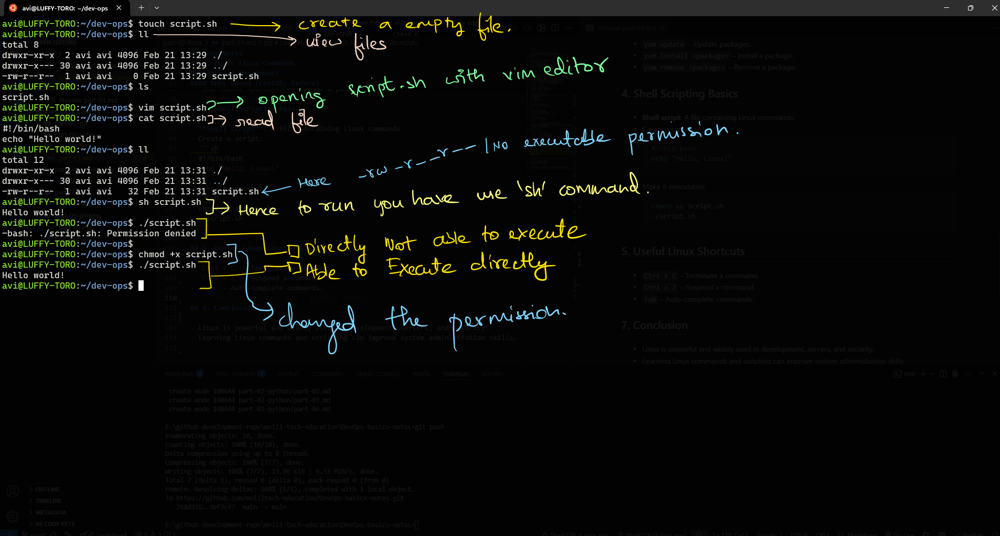

# Linux Notes

## 1. Introduction to Linux

- Linux is an open-source, Unix-like operating system.
- It is widely used in servers, desktops, and embedded systems.
- The core of Linux is the **kernel**, which manages hardware and system processes.

## 2. Linux File System

- **Root Directory (`/`)**: The top-level directory in Linux.
- **Home Directory (`/home/username/` (or) `~/`)**: Personal directory for users.
- **System Directories:**
  - `/bin` - Essential binaries.
  - `/etc` - Configuration files.
  - `/var` - Variable data (logs, cache, etc.).
  - `/tmp` - Temporary files.
  - `/usr` - User-installed software.

## 3. Basic Linux Commands

### File and Directory Management

- `ls` – List files and directories.
- `ll` - (Long List) List files and directories.
- `pwd` – Print current directory.
- `cd` – Change directory.
- `mkdir <dir>` – Create a new directory.
- `rm <file>` – Remove a file.
- `rm -r <dir>` – Remove a directory and its contents.
- `rm -rf <dir>` – Remove a directory and its contents forcefully.
- `cp <source> <destination>` – Copy files or directories.
- `mv <source> <destination>` – Move or rename files.

### File Viewing and Editing

- `cat <file>` – View file content.
- `vim <file>` – Open file in Vim editor.
- `nano <file>` – Open file in nano editor.

### How to use vim editor

- `Insert` key – Enter insert mode.
- `Esc` – Exit insert mode.
- After getting out of insert mode. You have use `:` then type below
- `:w` – Save the file.
- `:q` – Quit vim.
- `:wq` – Save and quit.
- `:q!` – Quit without saving.

### File Permissions

- `chmod` – Change file permissions.
  - eg: `chmod 400 file.pem`
- `ls -l` (or) `ll` – View file permissions.

### Process Management

- `ps` – List running processes.
- `top` – Show system processes.
- `kill <PID>` – Terminate a process.
- `htop` – Interactive process viewer (if installed).

### User Management

- `whoami` – Display current user.
- `who` – List logged-in users.

### Networking

- `ifconfig` / `ip addr show` – Show network information.
- `ping <host>` – Check network connectivity.
- `netstat -tulnp` – Show open ports.
- `curl <URL>` – Fetch a web page.
- `wget <URL>` - Download content from link.

### Package Management

#### Debian-based (Ubuntu, Debian)

- `apt update` – Update package lists.
- `apt install <package>` – Install a package.
- `apt remove <package>` – Remove a package.

#### RHEL-based (CentOS, Fedora)

- `yum update` – Update packages.
- `yum install <package>` – Install a package.
- `yum remove <package>` – Remove a package.

## 4. Shell Scripting Basics

- **Shell script**: A file containing Linux commands.
- Create a script:
  ```sh
  #!/bin/bash
  echo "Hello, Linux!"
  ```
- Make it executable:
  ```sh
  chmod +x script.sh
  ./script.sh
  ```

## 5. Useful Linux Shortcuts

- `Ctrl + C` – Terminate a command.
- `Ctrl + Z` – Suspend a command.
- `Tab` – Auto-complete commands.

## 7. Conclusion

- Linux is powerful and widely used in development, servers, and security.
- Learning Linux commands and scripting can improve system administration skills.


